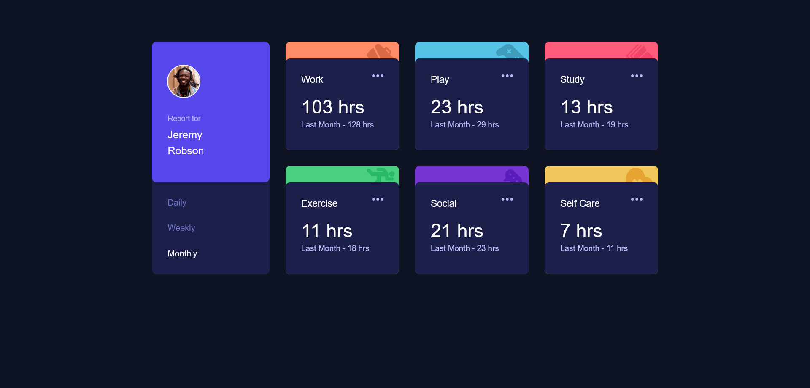

# Frontend Mentor - Time tracking dashboard solution

This is a solution to the [Time tracking dashboard challenge on Frontend Mentor](https://www.frontendmentor.io/challenges/time-tracking-dashboard-UIQ7167Jw). Frontend Mentor challenges help you improve your coding skills by building realistic projects. 

## Table of contents

- [Overview](#overview)
  - [The challenge](#the-challenge)
  - [Screenshot](#screenshot)
  - [Links](#links)
- [My process](#my-process)
  - [Built with](#built-with)
- [Author](#author)

## Overview

Time tracking dashboard using plain HTML, CSS and Vanilla JavaScript

### The challenge

Users should be able to:

- View the optimal layout for the site depending on their device's screen size
- See hover states for all interactive elements on the page
- Switch between viewing Daily, Weekly, and Monthly stats

### Screenshot

### Links

- Solution URL: [here](https://github.com/pilatech/time-tracking-dashboard)
- Live Site URL: [here](https://time-tracking-dashboard-by-pilate.netlify.app/)

## My process

- First created the markup with emphasis on semantics - my approach is 'desktop first' when it comes to marking up my documents even though I do peep into mobile layout here and there.
- Created CSS for mobile version
- Then I jumped into creating JavaScript for interactivity
- I then got back into completing the desktop styles

### Built with

- Semantic HTML5 markup
- CSS custom properties
- Flexbox
- CSS Grid
- Mobile-first workflow

## Author

- Frontend Mentor - [@pilatech](https://www.frontendmentor.io/profile/pilatech)
- Twitter - [@pchinyengetere](https://www.twitter.com/pchinyengetere)
